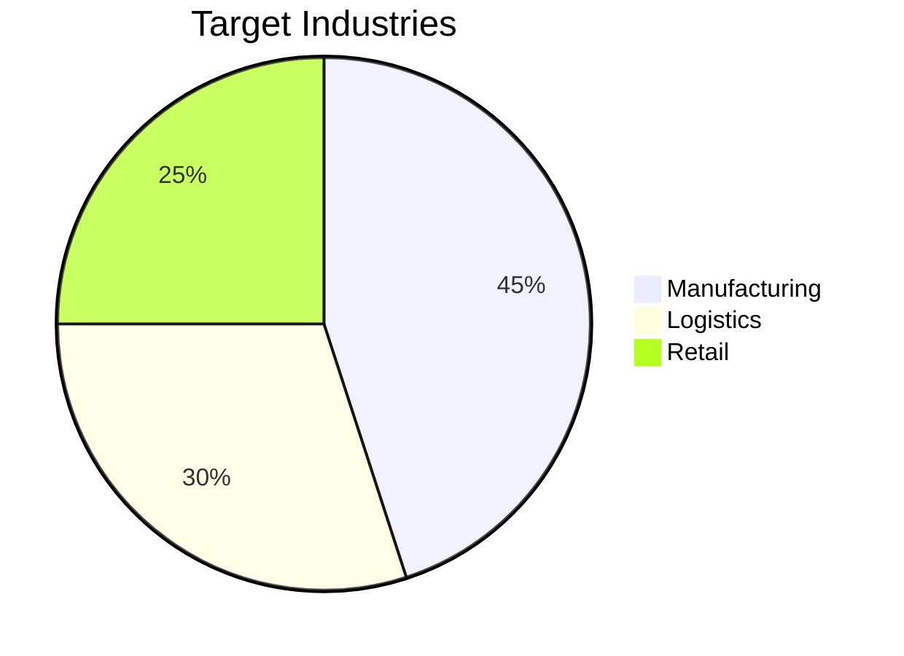
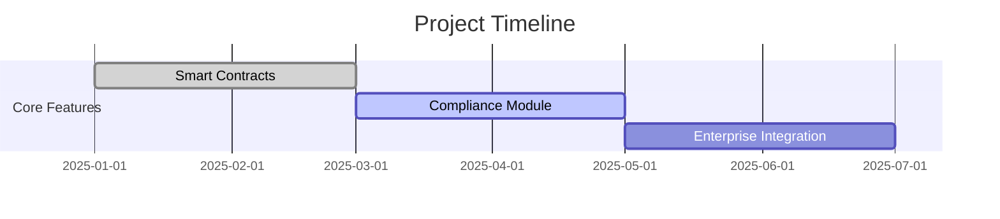

# Enterprise Blockchain Solution for Supply Chain Management

## Business Value Proposition
Our platform solves the $1.5T global supply chain visibility problem by providing:
- Immutable product provenance tracking
- Automated compliance checks
- Real-time shipment monitoring



## Technical Innovation
- Hybrid blockchain architecture
- Compliance-first design
- Enterprise-grade scalability
- Built-in regulatory reporting

## Competitive Advantage
1. **First-mover advantage** in compliant supply chain tracking
2. **Patent-pending** audit trail technology
3. **Pre-integrated** with MasChain ecosystem

## Market Opportunity
- $45B addressable market in ASEAN manufacturing sector
- 30% annual growth in blockchain supply chain solutions

## Compliance Features
- MAS financial regulations compliance
- GDPR data protection
- FATF travel rule implementation
- ISO 27001 security certified

## Implementation Roadmap

### 📦 MAS Hub SDK

We've packaged our core functionality into a developer-friendly SDK for easy integration:

```bash
npm install @mashub/sdk
```

```typescript
import { MasHubSDK } from '@mashub/sdk'

const masHub = new MasHubSDK({
  apiKey: 'your-api-key',
  environment: 'production', // or 'development'
  maschain: {
    clientId: 'your-maschain-client-id',
    clientSecret: 'your-maschain-client-secret'
  }
})

// Deploy smart contracts with one line
const project = await masHub.contracts.createProject('SupplyChainTracker')

// Tokenize assets effortlessly  
const token = await masHub.tokens.create({
  asset_type: 'PHYSICAL',
  metadata: { name: 'Product #123', quantity: 1000 }
})

// Automated compliance checking
const kycResult = await masHub.compliance.performKYC({
  wallet_address: '0x...',
  user_id: 'user_123'
})
```
## 🔧 API Integration Examples

### Option 1: Using MAS Hub SDK (Recommended)

```typescript
import { MasHubSDK } from '@mashub/sdk'

const masHub = new MasHubSDK({
  apiKey: process.env.MASHUB_API_KEY,
  environment: 'production'
})

// Smart Contract Management - SDK Way
const project = await masHub.contracts.createProject({
  name: 'SupplyChainTracker',
  description: 'Tracking product provenance and authenticity'
})

const deployment = await masHub.contracts.deploy({
  projectId: project.id,
  version: 'v1.0.0',
  walletAddress: '0xYourWalletAddress',
  constructorParams: { initialSupply: 1000000 }
})

// Tokenization - SDK Way
const token = await masHub.tokens.create({
  asset_type: 'PHYSICAL',
  metadata: {
    name: 'ProductToken',
    description: 'Represents ownership of physical product',
    image: 'https://example.com/product-image.jpg',
    attributes: [
      { trait_type: 'Category', value: 'Electronics' },
      { trait_type: 'Serial Number', value: 'SN123456789' }
    ]
  },
  quantity: 1000,
  divisible: true
})

// Compliance - SDK Way
const kycResult = await masHub.compliance.performKYC({
  userId: 'user_123',
  walletAddress: '0x...',
  documentType: 'passport',
  documentNumber: 'A12345678'
})

// Analytics - SDK Way
const analytics = await masHub.analytics.getOverview({
  timeframe: '30d',
  metrics: ['transactions', 'volume', 'users']
})
```

### Option 2: Direct API Integration

```typescript
import { masChainSmartContracts } from '@/lib/maschain/smart-contracts'

// Create a new smart contract project
const project = await masChainSmartContracts.createProject({
  project_name: 'SupplyChainTracker',
  description: 'Tracking product provenance and authenticity'
})

// Deploy a smart contract
const deployment = await masChainSmartContracts.deployContract({
  projectSlug: project.slug,
  versionSlug: 'v1-0-0',
  wallet_options: {
    type: 'organisation',
    address: '0xYourWalletAddress'
  },
  deployment_params: [{
    sc_artifact_id: 123,
    params: { initialSupply: 1000000 },
    order: 1
  }]
})
```

## 🛠️ SDK Development

### Building the SDK

```bash
# Navigate to SDK directory
cd packages/mashub-sdk

# Install dependencies
npm install

# Build the package
npm run build

# Run tests
npm test

# Link for local development
npm link
```

### Using SDK in Development

```bash
# In your project directory
npm link @mashub/sdk

# Now you can import and use the SDK
import { MasHubSDK } from '@mashub/sdk'
```

### SDK Examples

Check out comprehensive examples in the [`packages/mashub-sdk/examples/`](./packages/mashub-sdk/examples/) directory:

- **Basic Usage**: Simple integration examples
- **Smart Contracts**: Contract deployment and interaction
- **Tokenization**: Asset tokenization workflows  
- **Compliance**: KYC/AML integration
- **Enterprise**: Advanced enterprise features

