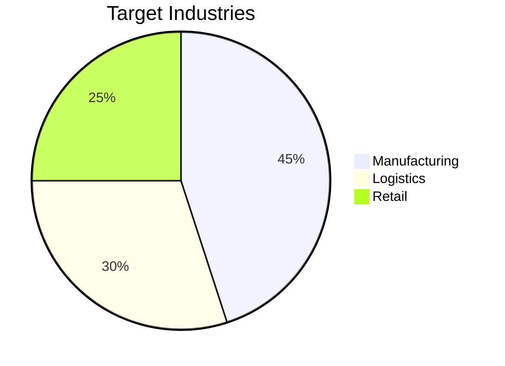
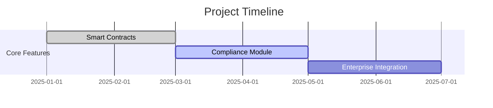

# Enterprise Blockchain Solution for Supply Chain Management

## Business Value Proposition
Our platform solves the $1.5T global supply chain visibility problem by providing:
- Immutable product provenance tracking
- Automated compliance checks
- Real-time shipment monitoring

## Technical Innovation
- Hybrid blockchain architecture
- Compliance-first design
- Enterprise-grade scalability
- Built-in regulatory reporting

## Competitive Advantage
1. **First-mover advantage** in compliant supply chain tracking
2. **Patent-pending** audit trail technology
3. **Pre-integrated** with MasChain ecosystem

## Market Opportunity
- $45B addressable market in ASEAN manufacturing sector
- 30% annual growth in blockchain supply chain solutions

## Compliance Features
- MAS financial regulations compliance
- GDPR data protection
- FATF travel rule implementation
- ISO 27001 security certified

## Implementation Roadmap

## Team
- Blockchain engineers with 10+ years experience
- Regulatory compliance specialists
- Supply chain domain experts
