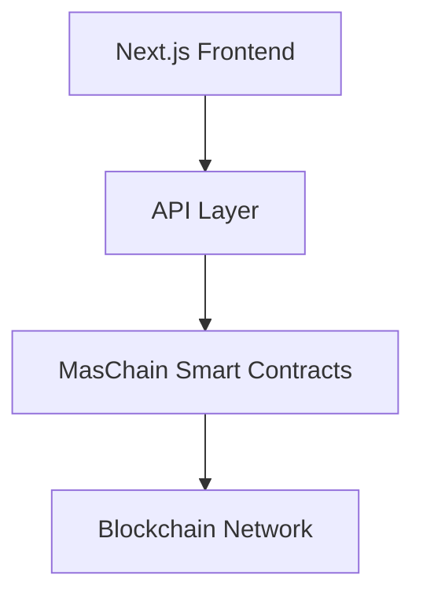

# 🚀 MAS Hub - modular SaaS platform for enterprises Web3 adoption 


## 🚀 MasChain Hackathon Project: Enterprise Smart Contract Platform
---

[](https://vercel.com/new/clone?repository-url=https://github.com/your-repo/mas-hub)
[](https://opensource.org/licenses/MIT)
[](https://maschain.com)

> **MasChain Hackathon 2025 Submission** - A Next.js enterprise platform for smart contract management, tokenization, and compliance built on MasChain blockchain infrastructure.

## 🎯 Overview

MAS Hub is a platform that bridges traditional business operations with blockchain technology through MasChain integration. Our solution provides seamless smart contract lifecycle management, automated compliance checking, and real-time transaction monitoring.

### Architecture Overview

A Next.js application integrating with MasChain for enterprise-grade smart contract management, tokenization, and compliance.



```
    A[Frontend] --> B[API Layer]
    B --> C[Supabase Database]
    B --> D[MasChain Smart Contracts]
    D --> E[Blockchain Network]
    C --> F[Real-time Notifications]
    B --> G[Compliance Engine]
    G --> H[Audit Trail]
```


### 🌟 Key Features

- **🔗 Smart Contract Lifecycle Management** - Create, deploy, and manage smart contracts
- **🏛️ Built-in Compliance Engine** - Automated KYC/AML and regulatory checks  
- **📊 Real-time Transaction Monitoring** - Live dashboard with WebSocket updates
- **🪙 Tokenization Workflows** - Asset tokenization with metadata management
- **📋 Audit Trail System** - Immutable logging for regulatory compliance
- **🔐 Enterprise Security** - Role-based access control and data encryption

---

## 🚀 Quick Start

### Prerequisites

- **Node.js** 18+ 
- **pnpm** (recommended) or npm
- **MasChain API credentials** ([Get them here](https://docs.maschain.com))
- **Supabase account** for database

### Installation

```bash
# Clone the repository
git clone https://github.com/Mas-hub-chain/mas-hub.git
cd mas-hub

# Install dependencies
pnpm install

# Copy environment template
cp .env.example .env.local
```

### Environment Configuration

Create `.env.local` with the following variables:

```env
# Next.js Configuration
NODE_ENV=development
NEXTAUTH_URL=http://localhost:3000
NEXTAUTH_SECRET=your_nextauth_secret

# Supabase Configuration
NEXT_PUBLIC_SUPABASE_URL=https://your-project.supabase.co
NEXT_PUBLIC_SUPABASE_ANON_KEY=your_supabase_anon_key
SUPABASE_SERVICE_ROLE_KEY=your_supabase_service_role_key

# MasChain Configuration
MASCHAIN_API_URL=https://api.maschain.com
MASCHAIN_CLIENT_ID=your_client_id
MASCHAIN_CLIENT_SECRET=your_client_secret
MASCHAIN_NETWORK=mainnet
MASCHAIN_MOCK_MODE=false

# Security
CSRF_SECRET=your_csrf_secret
MASCHAIN_WEBHOOK_SECRET=your_webhook_secret
```

### Database Setup

1. **Create Supabase Project**: Visit [supabase.com](https://supabase.com) and create a new project

2. **Run Database Migrations**: Execute the SQL scripts in order:

```bash
# Run in Supabase SQL Editor
scripts/001-initial-schema.sql
scripts/002-auth-profiles.sql  
scripts/003-audit-and-profiles.sql
scripts/005-phase4-advanced-features.sql
scripts/006-smart-contracts-schema.sql
scripts/007-fix-notifications-table.sql
```

### Running the Application

```bash
# Development mode
pnpm dev

# Production build
pnpm build
pnpm start

# Run tests
pnpm test

# Run with Docker
docker-compose up
```

Visit [http://localhost:3000](http://localhost:3000) to see the application.


## 🧪 Testing

### Running Tests

```bash
# Unit tests
pnpm test

# Integration tests  
pnpm test:integration

# E2E tests with Cypress
pnpm test:e2e

# Test coverage
pnpm test:coverage
```

### Test Structure

```
__tests__/
├── components/          # Component unit tests
├── lib/                # Library function tests  
├── api/                # API route tests
└── integration/        # Integration tests

cypress/
├── e2e/               # End-to-end tests
├── fixtures/          # Test data
└── support/           # Test utilities
```

## 🚀 Deployment

### Vercel Deployment 

1. **Connect Repository**: Link your GitHub repository to Vercel
2. **Set Environment Variables**: Add all production environment variables
3. **Deploy**: Vercel will automatically build and deploy

```bash
# Deploy with Vercel CLI
vercel --prod
```

### Docker Deployment

```bash
# Build and run with Docker Compose
docker-compose up --build

# Or build manually
docker build -t mas-hub .
docker run -p 3000:3000 mas-hub
```

### Environment-Specific Configurations

```bash
# Production
NODE_ENV=production
MASCHAIN_NETWORK=mainnet
MASCHAIN_MOCK_MODE=false

# Staging  
NODE_ENV=staging
MASCHAIN_NETWORK=testnet
MASCHAIN_MOCK_MODE=false

# Development
NODE_ENV=development
MASCHAIN_NETWORK=testnet
MASCHAIN_MOCK_MODE=true
```

## 📚 API Documentation

### Authentication

All API requests require authentication via NextAuth.js:

```typescript
// Protected API route example
import { getServerSession } from 'next-auth'
import { authOptions } from '@/app/api/auth/[...nextauth]/route'

export async function POST(request: Request) {
  const session = await getServerSession(authOptions)
  
  if (!session) {
    return Response.json({ error: 'Unauthorized' }, { status: 401 })
  }
  
  // Handle authenticated request
}
```

### Available Endpoints

| Endpoint | Method | Description | SDK Method |
|----------|--------|-------------|------------|
| `/api/smart-contracts/projects` | GET, POST | Manage smart contract projects | `masHub.contracts.createProject()` |
| `/api/smart-contracts/deployed` | GET | List deployed contracts | `masHub.contracts.listDeployed()` |
| `/api/tokenization` | POST | Create and manage tokens | `masHub.tokens.create()` |
| `/api/compliance/kyc` | POST | Perform KYC verification | `masHub.compliance.performKYC()` |
| `/api/audit/export` | GET | Export audit logs | `masHub.analytics.exportAudit()` |
| `/api/webhook` | POST | Handle MasChain webhooks | `masHub.webhooks.handle()` |

### Rate Limiting

API endpoints are rate-limited to prevent abuse:

```typescript
// Rate limiting configuration
const rateLimiter = {
  windowMs: 15 * 60 * 1000, // 15 minutes
  max: 100, // Limit each IP to 100 requests per windowMs
  message: 'Too many requests from this IP'
}
```

## 🛡️ Security Features

### Data Protection
- **Encryption at Rest**: All sensitive data encrypted using AES-256
- **Encryption in Transit**: TLS 1.3 for all communications
- **API Security**: Rate limiting, CORS protection, CSRF tokens

### Access Control
- **Role-Based Access Control (RBAC)**: Admin, Manager, User roles
- **Row Level Security (RLS)**: Database-level access control
- **Session Management**: Secure JWT tokens with rotation

### Compliance
- **GDPR Compliance**: Data portability and right to deletion
- **SOC 2 Type II**: Security controls and monitoring
- **ISO 27001**: Information security management

## 🤝 Contributing

### Development Workflow

1. **Fork the repository**
2. **Create feature branch**: \`git checkout -b feature/amazing-feature\`
3. **Make changes** and add tests
4. **Run tests**: \`pnpm test\`
5. **Commit changes**: \`git commit -m 'Add amazing feature'\`
6. **Push to branch**: \`git push origin feature/amazing-feature\`
7. **Open Pull Request**

### Code Standards

- **TypeScript**: Strict mode enabled
- **ESLint**: Airbnb configuration with custom rules
- **Prettier**: Automatic code formatting
- **Husky**: Pre-commit hooks for quality checks

### Pull Request Guidelines

- Include tests for new features
- Update documentation as needed
- Follow conventional commit messages
- Ensure CI/CD pipeline passes

## 📞 Support

### Documentation
- **API Docs**: [/docs/api](./docs/api)
- **Component Library**: [/docs/components](./docs/components)
- **Deployment Guide**: [/docs/deployment](./docs/deployment)

### Community
- **GitHub Issues**: Bug reports and feature requests
- **Discord**: Real-time community support
- **Email**: mashub.chain@gmail.com

### Troubleshooting

**Common Issues:**

1. **WebSocket Connection Errors**
   ```bash
   # Check Supabase URL matches between local and production
   echo $NEXT_PUBLIC_SUPABASE_URL
   ```

2. **MasChain API Errors**
   ```bash
   # Verify API credentials
   curl -H "client_id: $MASCHAIN_CLIENT_ID" \\
        -H "client_secret: $MASCHAIN_CLIENT_SECRET" \\
        https://api.maschain.com/api/contract/projects
   ```

3. **Database Connection Issues**
   ```bash
   # Test Supabase connection
   npx supabase status
   ```

## 📄 License

This project is licensed under the MIT License - see the [LICENSE](LICENSE) file for details.

## 🏆 Hackathon Submission

**MasChain Hackathon 2025**
- **Team**: MAS Hub Development Team
- **Category**: Enterprise Blockchain Solutions
- **Demo**: [https://mas-hub.vercel.app](https://mas-hub.vercel.app)

---

